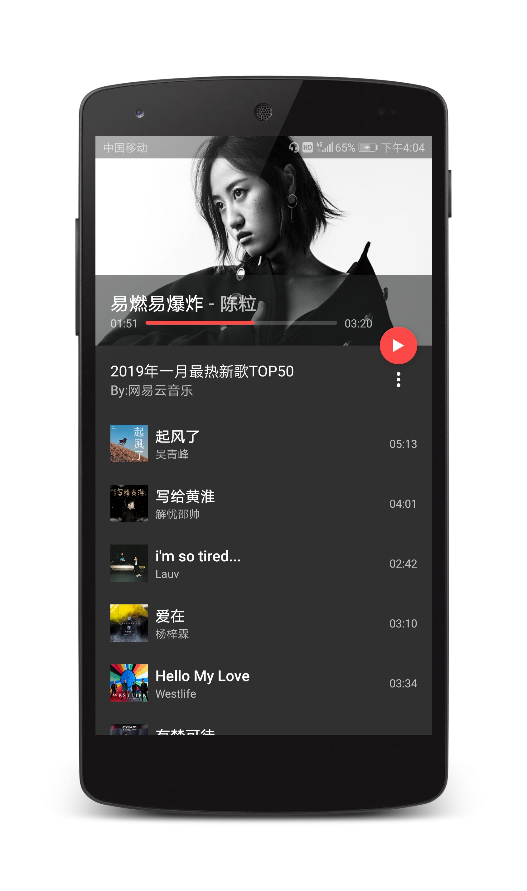
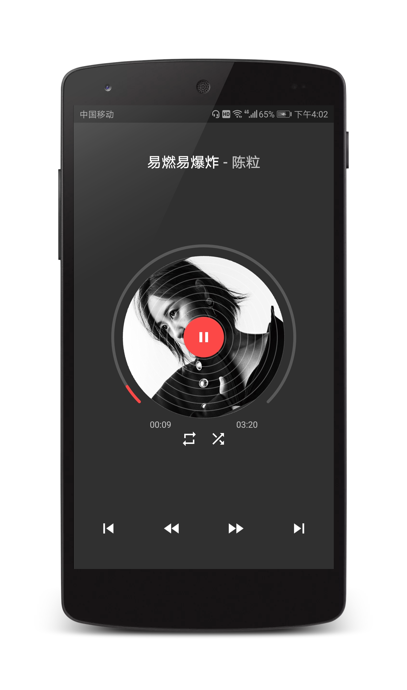

# NiceMusic

### A Nice MusicPlayer Powered by [StarrySky](https://github.com/lizixian18/StarrySky)


## Screenshots ：
<a href="art/art1.png"></a>
<a href="art/art2.png"></a> 
<a href="art/art3.png"></a>


## Statement
这是一个音频集成库  [StarrySky](https://github.com/lizixian18/StarrySky) 的一个小 demo。  
UI 来自项目  [Music-Player](https://github.com/andremion/Music-Player)，接口来自网易云音乐。  
demo 写得并不是那么的不完善，主要作用是简单演示一下 StarrySky 的使用方法。


如果你有想法或者意见和建议，欢迎提issue，喜欢点个star。


#### About me
An android developer in GuangZhou  
简书：[http://www.jianshu.com/users/286f9ad9c417/latest_articles](http://www.jianshu.com/users/286f9ad9c417/latest_articles)   
Email:386707112@qq.com  
If you want to make friends with me, You can give me a Email and follow me。

#### License
```
Copyright 2018 L_Xian   

Licensed under the Apache License, Version 2.0 (the "License");  
you may not use this file except in compliance with the License.  
You may obtain a copy of the License at  

http://www.apache.org/licenses/LICENSE-2.0  

Unless required by applicable law or agreed to in writing, software  
distributed under the License is distributed on an "AS IS" BASIS,  
WITHOUT WARRANTIES OR CONDITIONS OF ANY KIND, either express or implied.  
See the License for the specific language governing permissions and  
limitations under the License.
```
