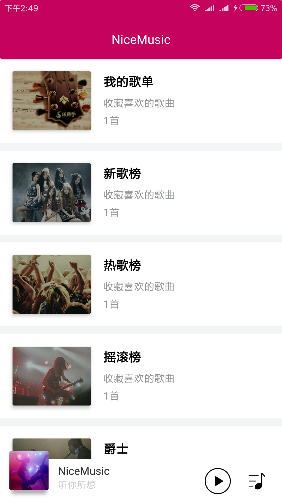
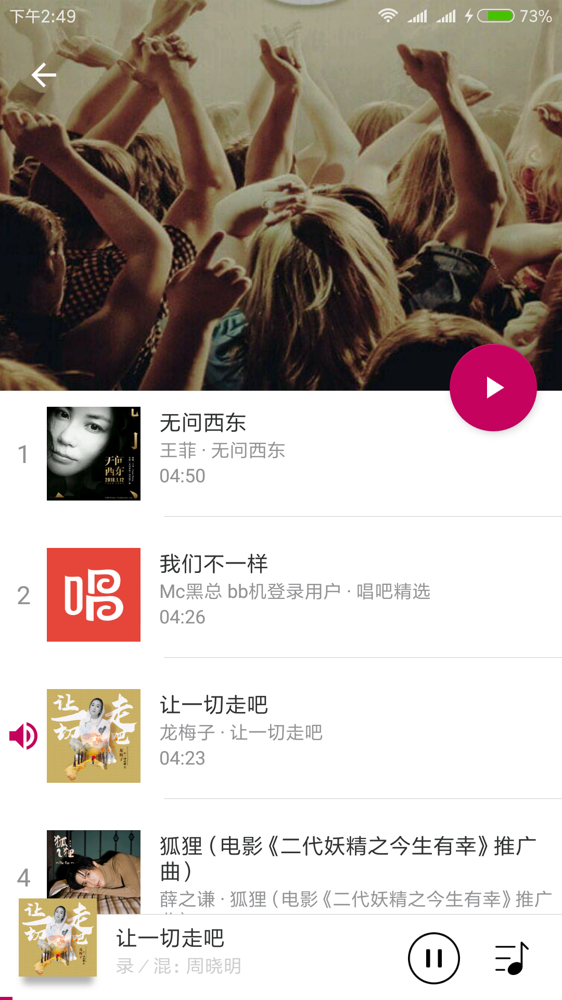
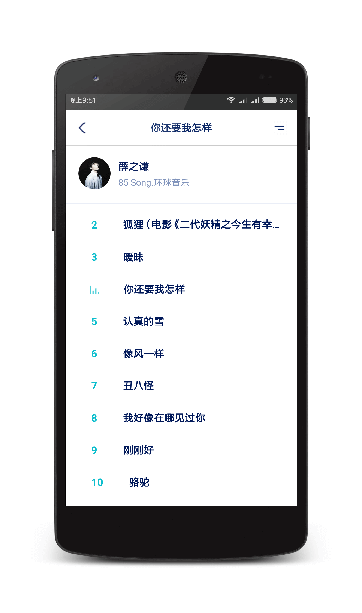
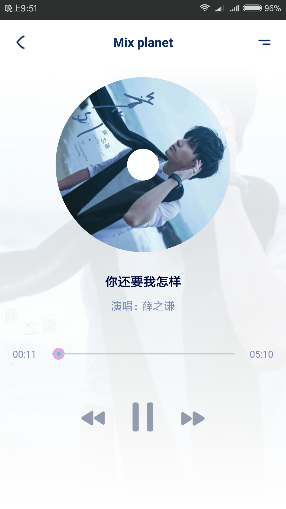
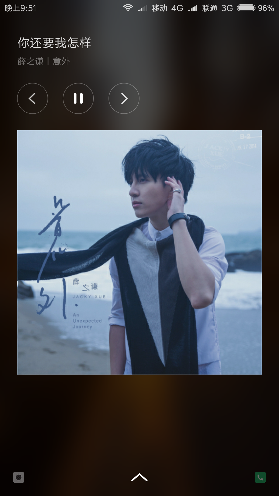
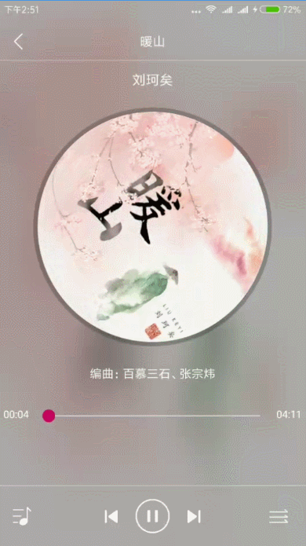

# NiceMusic

### A Nice MusicPlayer Powered by [MusicLibrary](https://github.com/lizixian18/MusicLibrary)


## Screenshots ：
<a href="art/image_1.png"></a>
<a href="art/image_2.png"></a> 
<a href="art/image_3.png"></a>
<a href="art/image_4.png"></a>
<a href="art/image_5.png"></a> 
<a href="art/ic_gif.gif"></a>

## Statement
本项目现阶段旨在尽量模拟各种场景来测试[MusicLibrary](https://github.com/lizixian18/MusicLibrary)，并作为一个例子去使用[MusicLibrary](https://github.com/lizixian18/MusicLibrary)，
所以做得比较粗糙，界面也不多，以后会慢慢完善起来，暂不提供Apk下载，有兴趣可以下载代码运行一下，一起学习。


如果你有想法或者意见和建议，欢迎提issue，喜欢点个star。

#### About me
An android developer in GuangZhou  
简书：[http://www.jianshu.com/users/286f9ad9c417/latest_articles](http://www.jianshu.com/users/286f9ad9c417/latest_articles)   
Email:386707112@qq.com  
If you want to make friends with me, You can give me a Email and follow me。

#### License
```
Copyright 2018 L_Xian   

Licensed under the Apache License, Version 2.0 (the "License");  
you may not use this file except in compliance with the License.  
You may obtain a copy of the License at  

http://www.apache.org/licenses/LICENSE-2.0  

Unless required by applicable law or agreed to in writing, software  
distributed under the License is distributed on an "AS IS" BASIS,  
WITHOUT WARRANTIES OR CONDITIONS OF ANY KIND, either express or implied.  
See the License for the specific language governing permissions and  
limitations under the License.
```
